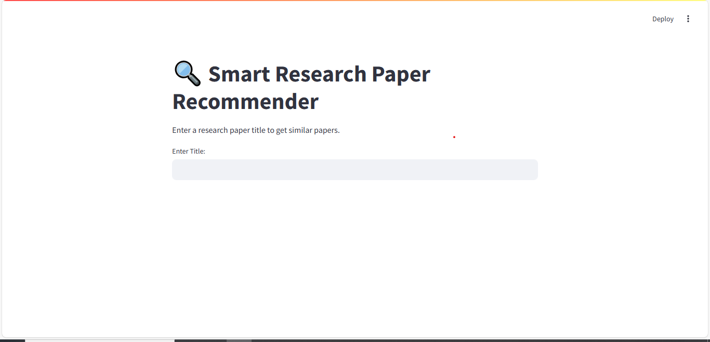
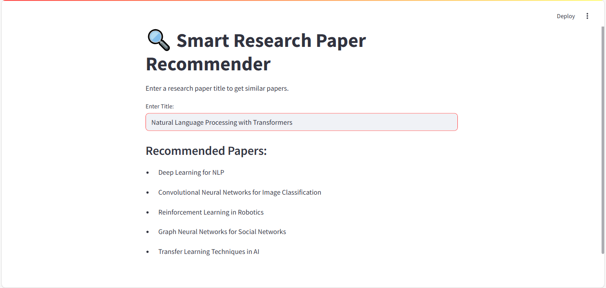
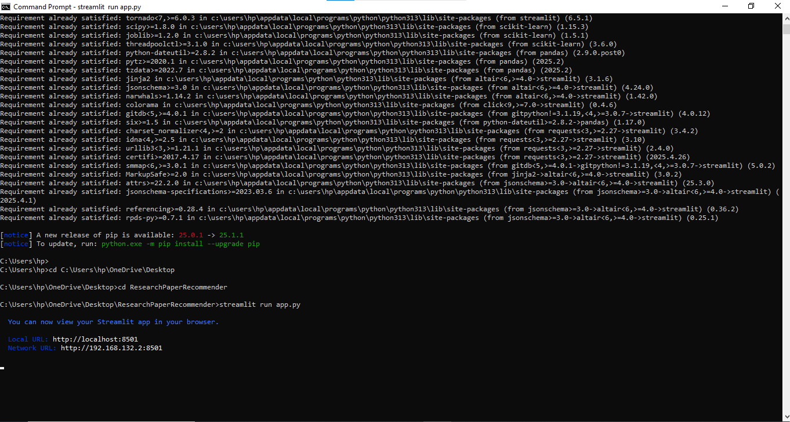

# 📚 Research Paper Recommender

A smart and lightweight Streamlit web app that recommends research papers based on a given title using Natural Language Processing. This project was created as part of my learning and portfolio-building journey in AI and Data Science.

---

## 🧠 Overview

Have you ever found an interesting research paper and wanted to discover similar ones instantly?  
This app helps solve that. Just enter the title of a research paper, and the app recommends five similar papers by analyzing textual similarity using NLP.

It's built to make academic exploration more intuitive for students, researchers, and curious minds.

---

## 🚀 Why I Built It

I created this project to deepen my understanding of recommendation systems and to practically apply NLP concepts. I also wanted to build a user-friendly AI tool that showcases real-world data science skills.

This project supports my application to:
- 🎓 **Sejong University** – Data Science (English Track)
- 🇰🇷 **Global Korea Scholarship (GKS)** – 2026 University Track

It demonstrates my ability to:
- Build and deploy AI-based web apps
- Apply machine learning to meaningful tasks
- Communicate ideas clearly through interactive tools

---

## 🛠️ Technologies Used

- **Python**
- **Streamlit** – For the web app interface
- **Pandas** – For data handling
- **Scikit-learn** – For TF-IDF vectorization and similarity

---

## 📂 File Structure

| File              | Description                                  |
|-------------------|----------------------------------------------|
| `app.py`          | Main Python code for the web app             |
| `papers.csv`      | Sample research paper titles (dataset)       |
| `01_homepage.png` | Screenshot of homepage UI                    |
| `02_results.png`  | Screenshot showing recommendation results    |
| `03_terminal.png` | Screenshot of terminal running the app       |

---

## 🖼️ Screenshots

**Homepage**  


**Recommendations**  


**Terminal**  


---

## 💡 How to Run the App

1. **Install required packages**:

streamlit run app.py


   ```bash
   pip install streamlit pandas scikit-learn
